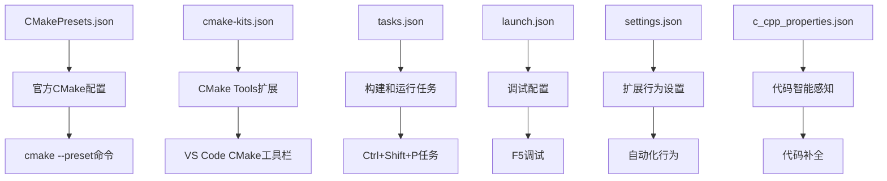

# CMake项目中JSON配置文件详解

## 📂 配置文件分类

您的项目中有两类配置文件：
1. **CMake官方配置文件** - CMake原生支持
2. **VS Code扩展配置文件** - VS Code特定功能

---

## 🎯 CMake官方配置文件

### 1. `CMakePresets.json` (项目根目录)
```
作用: CMake 3.19+ 官方预设配置文件
用途: 标准化项目构建配置，团队共享
```

**功能详解:**
- **配置预设**: 定义不同的构建配置（Debug、Release等）
- **构建预设**: 定义构建参数和选项
- **测试预设**: 定义测试运行参数
- **跨平台**: 一套配置适用于所有平台

**您的配置包含:**
```json
"configurePresets": [
    {
        "name": "default",           // 默认Debug配置
        "generator": "MinGW Makefiles",
        "binaryDir": "build"
    },
    {
        "name": "release",           // Release配置
        "binaryDir": "build-release"
    }
]
```

**使用方法:**
```bash
# 使用预设配置
cmake --preset default
cmake --build --preset default

# 列出所有预设
cmake --list-presets
```

---

## 🔧 VS Code扩展配置文件

### 2. `.vscode/cmake-kits.json`
```
作用: CMake Tools扩展的工具链配置
用途: 定义编译器和工具链信息
```

**功能详解:**
- **编译器路径**: 指定C/C++编译器位置
- **生成器偏好**: 设置首选的CMake生成器
- **环境变量**: 设置构建时的环境变量

**您的配置:**
```json
{
    "name": "MinGW GCC",
    "compilers": {
        "C": "E:\\msys64\\ucrt64\\bin\\gcc.exe",
        "CXX": "E:\\msys64\\ucrt64\\bin\\g++.exe"
    },
    "preferredGenerator": {
        "name": "MinGW Makefiles"
    }
}
```

### 3. `.vscode/tasks.json`
```
作用: VS Code任务配置
用途: 定义构建、运行、清理等任务
```

**功能详解:**
- **构建任务**: CMake Configure、CMake Build
- **运行任务**: Run CMake FEM Solution
- **复合任务**: Build and Run
- **快捷键绑定**: 与VS Code快捷键系统集成

**关键任务:**
```json
{
    "label": "CMake Build",           // 默认构建任务
    "command": "cmake",
    "args": ["--build", "build"],
    "group": {"kind": "build", "isDefault": true}
}
```

### 4. `.vscode/launch.json`
```
作用: VS Code调试配置
用途: 定义如何启动和调试程序
```

**功能详解:**
- **调试器设置**: 指定GDB调试器路径
- **程序路径**: 指定要调试的可执行文件
- **预启动任务**: 调试前自动构建
- **调试选项**: 断点、变量查看等设置

**您的配置:**
```json
{
    "name": "Debug CMake FEM Solver",
    "program": "${workspaceFolder}/build/bin/FEM_solution.exe",
    "preLaunchTask": "CMake Build",  // 调试前先构建
    "miDebuggerPath": "E:\\msys64\\ucrt64\\bin\\gdb.exe"
}
```

### 5. `.vscode/settings.json`
```
作用: VS Code工作区设置
用途: 配置CMake Tools扩展行为
```

**功能详解:**
- **自动配置**: 打开项目时自动运行CMake配置
- **构建目录**: 指定构建输出目录
- **默认生成器**: 设置首选的CMake生成器

**关键设置:**
```json
{
    "cmake.configureOnOpen": true,    // 自动配置
    "cmake.buildDirectory": "build",  // 构建目录
    "cmake.generator": "MinGW Makefiles"
}
```

### 6. `.vscode/c_cpp_properties.json`
```
作用: C/C++扩展配置
用途: 配置IntelliSense和代码分析
```

**功能详解:**
- **包含路径**: 头文件搜索路径
- **编译器路径**: IntelliSense使用的编译器
- **C++标准**: 代码分析使用的语言标准
- **智能感知模式**: 代码补全和错误检测

---

## 🔄 配置文件之间的关系



## 📊 配置文件优先级和作用域

| 配置文件 | 作用域 | 优先级 | 团队共享 |
|----------|--------|--------|----------|
| `CMakePresets.json` | 项目级 | 最高 | ✅ 推荐 |
| `cmake-kits.json` | VS Code | 中等 | ❌ 个人化 |
| `tasks.json` | VS Code | 中等 | ✅ 可共享 |
| `launch.json` | VS Code | 中等 | ✅ 可共享 |
| `settings.json` | 工作区 | 低 | ⚠️ 部分共享 |
| `c_cpp_properties.json` | C++扩展 | 低 | ✅ 可共享 |

## 🎯 实际使用场景

### 场景1: 团队开发
```bash
# 共享这些文件
├── CMakePresets.json     ✅ 版本控制
├── .vscode/
│   ├── tasks.json        ✅ 版本控制
│   ├── launch.json       ✅ 版本控制
│   └── settings.json     ⚠️ 部分共享

# 个人化配置
├── .vscode/
│   ├── cmake-kits.json   ❌ 添加到.gitignore
│   └── c_cpp_properties.json  ⚠️ 路径可能需要调整
```

### 场景2: 不同构建类型
```bash
# 使用预设快速切换
cmake --preset default     # Debug构建
cmake --preset release     # Release构建
cmake --preset debug-with-tests  # 带测试的Debug构建
```

### 场景3: VS Code集成开发
```
1. 打开项目 → settings.json触发自动配置
2. 按F7构建 → tasks.json执行CMake Build
3. 按F5调试 → launch.json启动调试会话
4. 代码补全 → c_cpp_properties.json提供智能感知
```

## 🛠️ 维护建议

### 应该版本控制的文件:
- ✅ `CMakePresets.json` - 标准化团队构建
- ✅ `.vscode/tasks.json` - 统一任务定义
- ✅ `.vscode/launch.json` - 统一调试配置

### 应该忽略的文件:
- ❌ `.vscode/cmake-kits.json` - 包含个人路径
- ❌ `build/` 目录下的所有CMake生成文件

### 可选共享的文件:
- ⚠️ `.vscode/settings.json` - 去除个人化设置后可共享
- ⚠️ `.vscode/c_cpp_properties.json` - 路径相对化后可共享

## 🚀 最佳实践

1. **优先使用CMakePresets.json** - 这是官方标准
2. **保持VS Code配置简洁** - 避免过度定制
3. **使用相对路径** - 提高配置的可移植性
4. **文档化特殊配置** - 为团队成员提供说明

这样的配置体系让您既能享受VS Code的便利，又能保持CMake项目的标准化和可移植性！